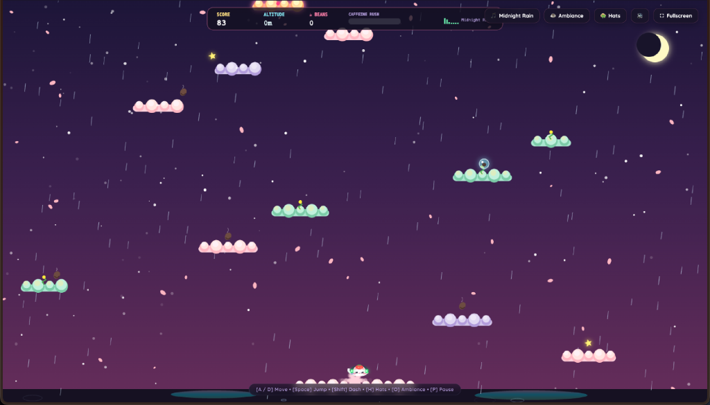

# Lo-Fi Cloud Hopper

> A cozy, fullscreen 16-bit beat runner and cloud hopper. Leap across dreamy neon city rooftops, collect coffee beans to activate Caffeine Rush, and chill to procedurally synthesized lo-fi chords in real time.



[](https://deevredd.github.io/cloud-hopper-pixel-game-/)
[](LICENSE)
[](https://developer.mozilla.org/en-US/docs/Web/API/Canvas_API)
[](https://developer.mozilla.org/en-US/docs/Web/API/Web_Audio_API)

---

## Features

- **Immersive Fullscreen Experience**: Dynamic edge-to-edge canvas that scales to any screen resolution or mobile device, with a native one-click fullscreen toggle.
- **Dynamic Altitude Biomes**:
  - **Neon City Streets (0 - 1,200m)**: Rainy night skyline, illuminated windows, glowing shop neon signs (`LO-FI CAFE`, `RAMEN 24H`, `CAT LOUNGE`), and puddle reflections.
  - **Twilight Sakura (1,200 - 2,800m)**: Warm purple sunset sky with drifting glowing sakura petals.
  - **Aurora Stratosphere (2,800 - 5,000m)**: Wavy aurora borealis ribbons and a massive glowing crescent moon.
  - **Cosmic Orbit (5,000m+)**: Deep space void, shooting stars, and twinkling constellations.
- **Power-Ups and Collectibles**:
  - **Coffee Beans**: Fills the Caffeine Rush gauge at the top.
  - **Caffeine Rush**: Triggers magnetic collection, rainbow speed boost, and high combo multipliers.
  - **Boba Bubble Shield**: Encapsulates the kitten in a bouncy bubble that saves you from a fatal fall.
  - **Star Crystals**: Plays ascending melodic chords in a pentatonic scale.
  - **Catnip**: Triggers an instant combo frenzy.
- **Multi-Tier Clouds**:
  - **Pastel Pink**: Soft standard cloud.
  - **Matcha Spring**: Compresses on impact and launches you high into the air.
  - **Lavender Vapor**: Fades and dissolves after one second of standing on it.
  - **Rainbow Star Clouds**: Provides score multipliers and high-speed bounces.
- **Generative Lo-Fi Radio (Web Audio API)**:
  - Three switchable tracks: **Midnight Rain**, **Sakura Tea**, and **Neon Cosmos**.
  - Gentle filtered rain noise generator and subtle vintage vinyl crackle.
- **Kitty Wardrobe**:
  - Switch hats on the fly (Key `H` or the Hat button): Strawberry, Wizard, Detective, Royal Crown, Angel Halo, or Sakura Blossom.

---

## Controls

| Key | Action |
| :--- | :--- |
| **A / D** or **Left / Right Arrow** | Move Left / Right |
| **Space** or **W** / **Up Arrow** | Jump (Tap again in mid-air for Spin Double Jump) |
| **Shift** or **X** | Air Dash |
| **H** | Open Kitty Hat Wardrobe |
| **P** or **ESC** | Pause Game |
| **Tap / Touch** | Fullscreen touch controls for mobile and tablet devices |

---

## Running Locally

```bash
# Clone the repository
git clone https://github.com/deevredd/cloud-hopper-pixel-game-.git
cd cloud-hopper-pixel-game-

# Run with Python's built-in server
python3 -m http.server 3000

# Open http://localhost:3000 in your browser
```

---

## License

MIT License (c) 2026 Deevna Reddy
